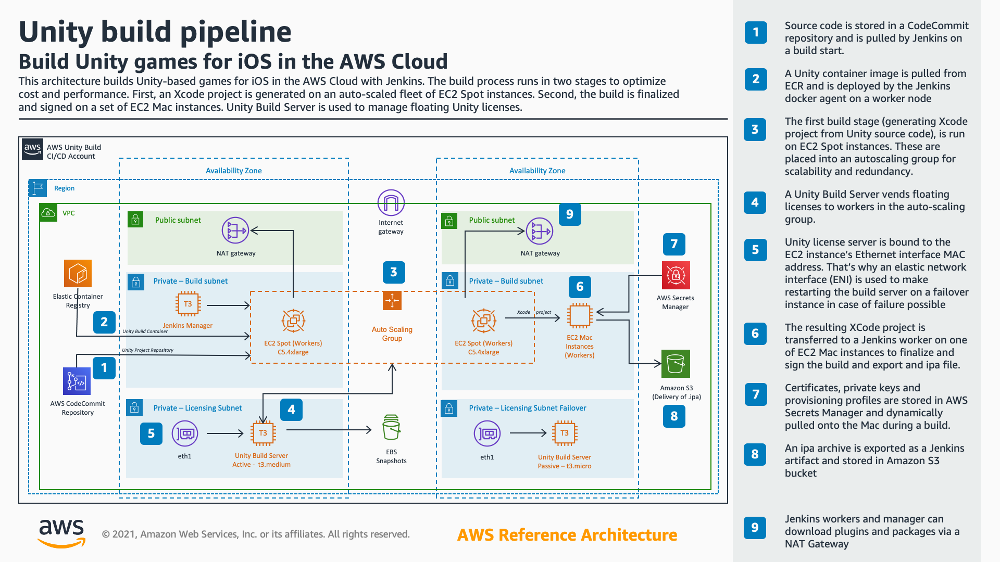

# Unity builds on EC2 Mac and Spot

## Overview

This is a sample Jenkins pipeline to build Unity applications on a mix of Amazon EC2 Spot Linux instances and [Amazon EC2 Mac instance](https://aws.amazon.com/ec2/instance-types/mac/) in the AWS Cloud.

This hybrid approach improves performance and reduces cost compared to building everything on EC2 Mac. The build happens in two stages: first, a Unity project is built on a scalable fleet of Linux Spot instances, then the resulting xcode project is finalized and signed on a single EC2 Mac instance if you have the Apple developer profile. Otherwise *.xcarchive* file is built which can be used for debugging on a local device and signed later.

## Deployment instructions

There's a CloudFormation template to provision required AWS resources and a guide to complete manual steps. See the [Lab](https://catalog.us-east-1.prod.workshops.aws/workshops/43e96ac6-6d4f-4d99-af97-3ac2a5987391/en-US/020-build-farms/060-labs-unity-mac) for details.

## Architecture

